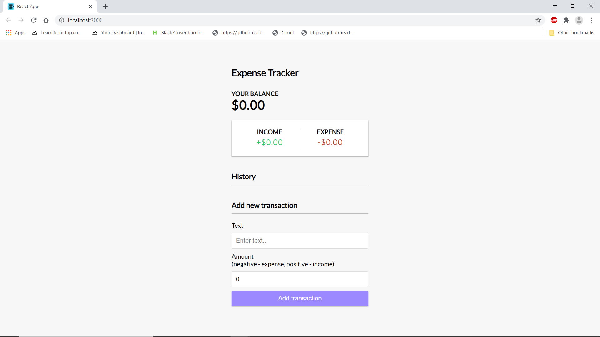

# Expense Tracker (React)

This is a React version of the [vanilla JS Expense Tracker](https://github.com/pritsorathiya5181/expense-tracker-react). It uses functional components with hooks and the context API
Keep track of income and expenses. Add and remove items and save to local storage

## Usage
```
npm install

# Run on http://localhost:3000
npm start

# Build for prod
npm run build
```

## Project Specifications

- Create UI for project
- Display transaction items in DOM
- Show balance, expense and income totals
- Add new transation and reflect in total
- Delete items from DOM
- Persist to local storage


## Demo


