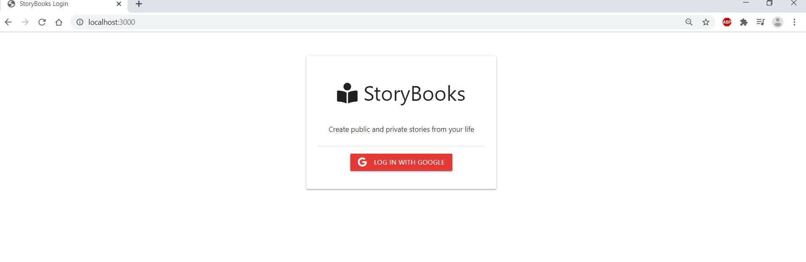
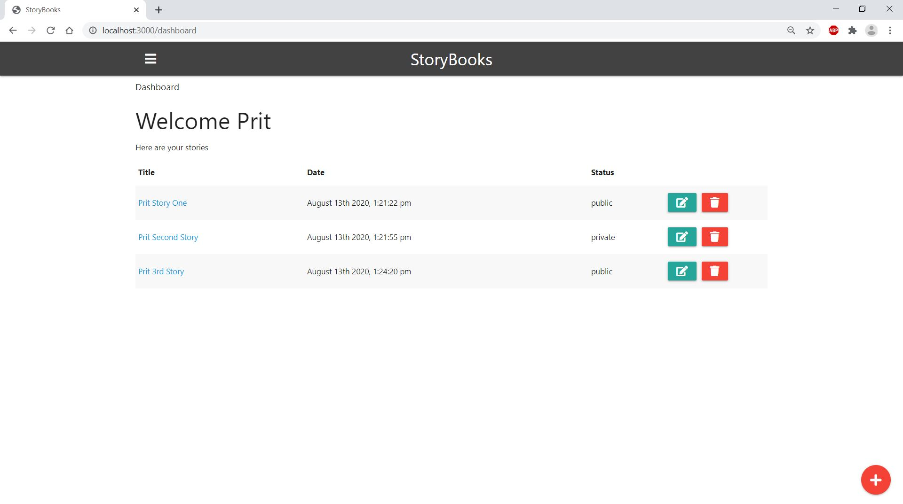
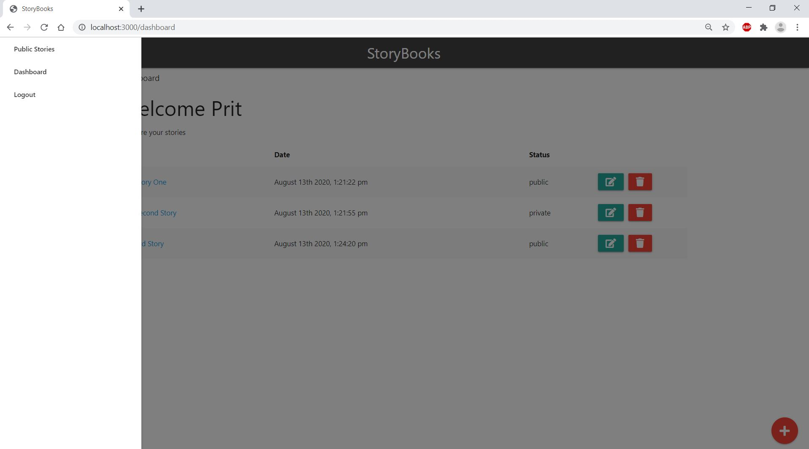
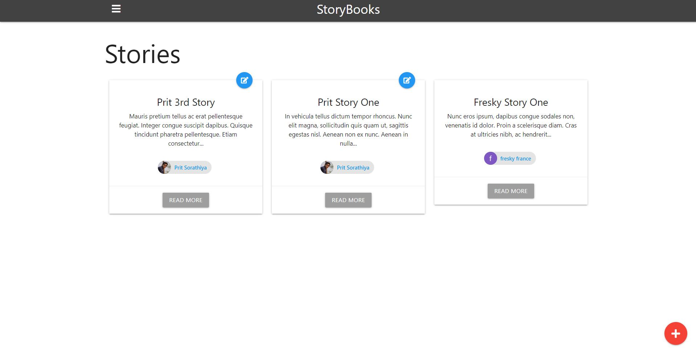

# StoryBooks

> Create public and private stories from your life

This app uses Node.js/Express/MongoDB with Google OAuth for authentication

## Usage

Add your mongoDB URI and Google OAuth credentials to the config.env file

```
# Install dependencies
npm install

# Run in development
npm run dev

# Run in production
npm start
```

## Project Specifications


- Template Engine & Layouts 
- Materialize & Font Awesome
- Passport with a Google OAuth strategy
- Display Dashboard Stories - 1:14:44
- Add New Story and Set Privacy (i.e. public or private)
- Edit and Delete Stories
- Single Story Page 
- User Stories 


## Demo





