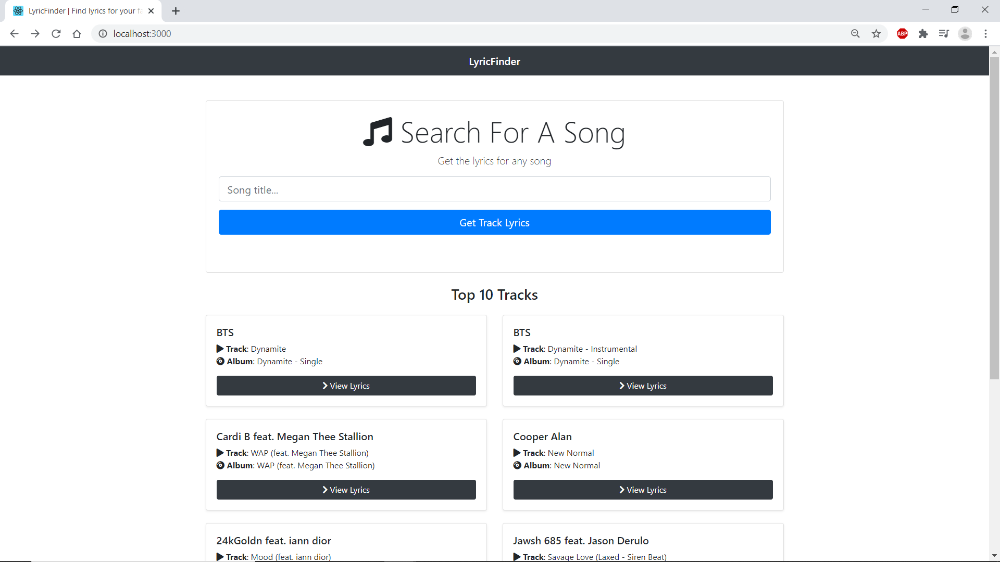
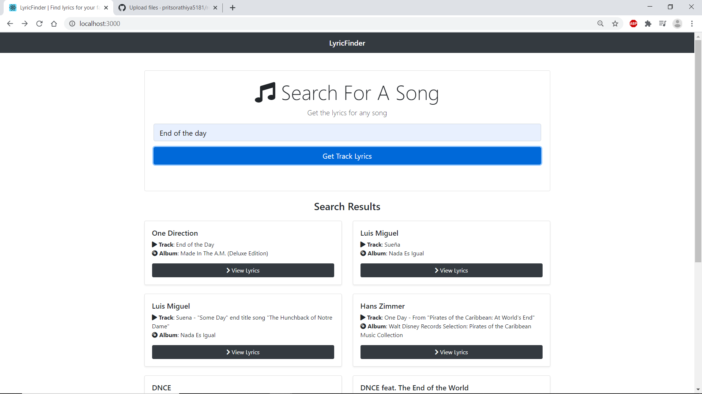

# LyricFinder App || Refactored using React Hooks

> App that finds song lyrics using React and the Musixmatch API.

## Musixmatch API

Get your API key and add to the .ENV file

[https://developer.musixmatch.com](https://developer.musixmatch.com)

## Quick Start

```bash
# Install dependencies
npm install

# Serve on localhost:3000
npm start

# Build for production
npm run build
```

## Demo



